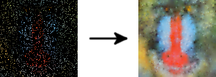

# 🖼️ Incremental Image Reconstruction

This repository is the implementation part of the diploma thesis
done as part of the bachelor's degree at *Faculty of Computer and
Information Science* in Ljubljana.

<p align="center">
    
</p>

In this thesis we present multigrid method approach for reconstructing
images from scattered data. The reconstruction is implemented in WebGL
as an interactive website as well as in Python. We also use neural
networks to recover the lost details in the image after the reconstruction
is done.

Reconstruction is done using system of linear equations solvers:

- Jacobi,
- Successive over-relaxation,
- Conjugate gradient,
- Multigrid.

All solvers are implemented in both implementations.

## WebGL implementation

To run WebGL implementation `node` and `npm` are required. First all used
packages need to be installed using

```bash
npm install
```

Then `.tsc` files can be compiled and the server can be run using

```bash
npm run build
npm start
```

Website is available at [localhost:3000](http://localhost:3000).

## Python implementation

Required Python packages are in `requirements.txt`.

Solvers are implemented in [solvers.py](src/python/solvers.py) and example
usage is presented in [main.py](src/python/main.py).

## Autoencoder

Neural network to restore details is implemented using PyTorch. Model
implemented in [model.ipynb](src/autoencoder/model.ipynb) predicts image
using the reconstructed one and
[model_corrupted.ipynb](src/autoencoder/model_corrupted.ipynb) using the
corrupted one.

A subset (27k) of CompCars dataset has been used to train the models. All
images have been preprocessed using
[preprocess_image.py](src/python/preprocess_images.py). Images were
cropped to 256x256 and 5 % of random pixels were selected to be preserved.

Below an example of details restoration can be seen.

<p align="center">
    
</p>

## References

- [RPGUI](https://github.com/RonenNess/RPGUI): CSS framework by RonenNess
  has been used in modified form to stylize the interactive reconstruction
  website.
- Linjie Yang, Ping Luo, Chen Change Loy, Xiaoou Tang. A Large-Scale
  Car Dataset for Fine-Grained Categorization and Verification, In
  Computer Vision and Pattern Recognition (CVPR), 2015
